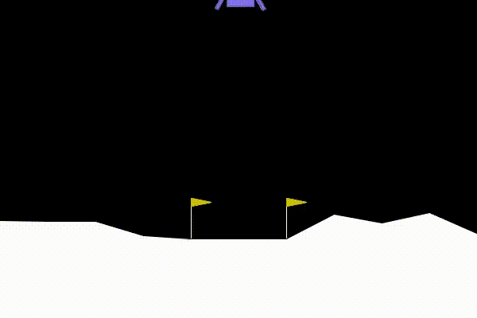

# Lunar Lander - Deep Q-Network (DQN)

A custom implementation of a **Deep Q-Network (DQN)** agent trained to land a spacecraft on the Moon using the [Gymnasium LunarLander-v3](https://gymnasium.farama.org/environments/box2d/lunar_lander/) environment. The trained agent achieves a **93%+ success rate** over 300 evaluation episodes.



---

## Overview

This project demonstrates reinforcement learning with a DQN agent from scratch, using:
- **Experience Replay** with a fixed-size memory buffer
- **Target Network** with soft updates (Polyak averaging) for stable training
- **Epsilon-greedy exploration** with exponential decay
- **Huber Loss** (Smooth L1) for robust gradient updates
- **Early stopping** when a 90% success rate (reward > 200) is achieved over a rolling 50-episode window

The model is trained on a **Google Colab T4 GPU** and converges within ~858 episodes.

---

## Results

| Metric | Value |
|---|---|
| Training Episodes to Convergence | ~858 |
| Evaluation Episodes | 300 |
| **Success Rate (reward > 200)** | **93.33%** |
| Average Reward (Eval) | ~252 |

---

## Model Architecture

The Q-Network (`QNetwork`) is a fully connected neural network:

```
Input (8) -> Linear(64) -> ReLU -> Linear(64) -> ReLU -> Linear(64) -> ReLU -> Output (4)
```

- **Input:** 8 state features (position, velocity, angle, angular velocity, leg contacts)
- **Output:** Q-values for 4 discrete actions (do nothing, left engine, main engine, right engine)

---

## Hyperparameters

| Parameter | Value |
|---|---|
| Episodes (max) | 1000 |
| Discount Factor (gamma) | 0.99 |
| Soft Update Rate (tau) | 0.005 |
| Batch Size | 128 |
| Initial Epsilon | 1.0 |
| Min Epsilon | 0.05 |
| Epsilon Decay | 0.995 |
| Replay Buffer Size | 10,000 |
| Replay Start Size | 128 |
| Learning Rate | 1e-4 |
| Optimizer | Adam |
| Loss Function | Smooth L1 (Huber) |

---

## Repository Structure

```
Lunar-Lander/
├── Lunar_Lander_93.ipynb   # Main training & evaluation notebook
├── QNet_93.pth             # Saved Q-Network weights (trained)
├── TargetNet_93.pth        # Saved Target Network weights (trained)
├── Lunar-Lander-vid.gif    # Demo GIF of the trained agent
└── README.md
```

---

## Getting Started

### Prerequisites

```bash
pip install swig
pip install "gymnasium[box2d]"
pip install torch
```

### Running the Notebook

Open `Lunar_Lander_93.ipynb` in Jupyter or Google Colab and run all cells to:
1. Train the DQN agent from scratch, **or**
2. Load the pre-trained weights (`QNet_93.pth`) and evaluate directly

### Loading Pre-trained Weights

```python
import torch
from torch import nn

class QNetwork(nn.Module):
    def __init__(self):
        super().__init__()
        self.fc = nn.Sequential(
            nn.Linear(8, 64), nn.ReLU(),
            nn.Linear(64, 64), nn.ReLU(),
            nn.Linear(64, 64), nn.ReLU(),
            nn.Linear(64, 4)
        )

    def forward(self, x):
        return self.fc(x)

model = QNetwork()
model.load_state_dict(torch.load("QNet_93.pth", map_location="cpu"))
model.eval()
```

---

## Training Loop Summary

1. Observe the current state from the environment.
2. Select an action using the epsilon-greedy policy (random vs. greedy).
3. Execute the action, receive the reward, and observe the next state.
4. Store the experience `(state, action, reward, next_state, done)` in the replay buffer.
5. Once the buffer has >= 128 samples, sample a mini-batch and compute:
   - Current Q-values: `Q(s, a)`
   - Target Q-values: `r + gamma * max_a' Q_target(s', a') * (1 - done)`
6. Compute Huber loss between current and target Q-values.
7. Backpropagate and update Q-Network weights.
8. Soft-update the Target Network: `theta_target <- tau * theta + (1 - tau) * theta_target`
9. Decay epsilon after each episode.
10. Stop early if the 50-episode rolling success rate exceeds 90%.

---

## License

This project is licensed under the [MIT License](LICENSE).